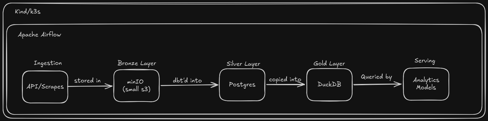

# Fantasy Football

This repo will contain a few things that serve my goal of creating something that

1. Teaches me rust
3. Itches my data platform itch
4. Looks good on resume (of course)
5. Lets me not lose fantasy football next year

## How will I accomplish this?

I believe everything can be solved with enough data - if I didn't believe that I'd be a front end dev.

## How is data going to help you here? You suck at fantasy

Yes, but I've contributed to some good data platforms in my time. Data will help me answer

- what should my draft order be? (draft rankings)
- who should I pick up week 8? (weekly rankings)
- is there any obvious trades I should propose? (trade analysis/player value)

## What data tho?

Anything.

- box scores
- prior drafts
- betting lines

## How are you going to do this?

Well, by building my personal data platform of course! We will need

- medallion stores
    - bronze -> minIO
    - silver -> postgres
    - gold -> duckdb
- job orchestration
    - airflow
    - dbt (cosmos?)
- container orchestration
    - k8s (kind and eventually k3s)

Out of scope
- metadata store (I know where all the tables are, I made them)
- o11y (logs/metrics via loki/graf/prom just feels like a lot of work)
- streaming (I don't need Kafka to lose on Sundays faster)

## Did you mention Rust?

Yeah, I want to learn it bc it
- is fast
- is valuable to know
- hate being a python only dev

Likely uses include
- control plane apis
- data access apis
- clis

## What do you hope to learn?

- rust
- self managed scheduler
- self managed container orchestration
- maybe buy a domain and host some apis i can hit from anywhere (maybe claude a FE)
- gpu workloads on k8s (after i build my pc)

## Order

- [ ] Stand everything up
    - [x] kind
    - [ ] airflow
    - [ ] minio
    - [ ] postgres
    - [ ] duckdb
- [ ] ingest one dataset e2e
    - [ ] build the abstractions for each ingestion piece
    - [ ] load in minio
    - [ ] document standards for silver layer into postgres
    - [ ] figure out what goes in duckdb one of these days?
    - [ ] train some model somehow
    - [ ] profit
